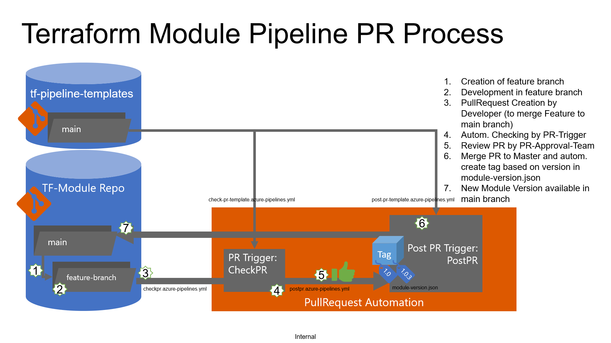

# Deployment concept Terraform Modules

## CheckPR
The CheckPR-Pipeline hat to be created by each terraform module. This can be easily done by using the pipeline yaml file 'checkpr.azure-pipelines.yml'. This Pipeline has to be include in the build validation of this repository. [See](https://docs.microsoft.com/en-us/azure/devops/repos/git/branch-policies?view=azure-devops#build-validation).
### Performed checks in CheckPR
The following checks are performed in the CheckPR pipeline:
- a valid module-version.json file exists
- E2E-Test will be performed with [pester](https://pester.dev/) if a *.ps1 file exists in directory ./test/

## PostPR
The PostPR-Pipeline hat to be created by each terraform module. This can be easily done by using the pipeline yaml file 'postpr.azure-pipelines.yml'.The PostPR-Pipelin is automatically invoked by merging a specific PR into the main branch of the module repository. 

### Performed Actions within PostPR Pipeline
- Create Major.Minor tag according file module-version.json within module repository. E.g. 1.0
- Create Major.Minor-Patch tag according file module-version.json within module repository. The patch version will be set to the current BuildID. E.g. 1.0.37
- Update PR comments in current PR

# Links and Resources for App Deployment
https://docs.microsoft.com/en-us/azure/devops/pipelines/get-started/key-pipelines-concepts?view=azure-devops